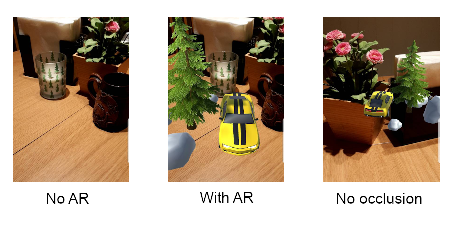

<!--
# Education - Elements of AI (Building AI)
# Link:   https://buildingai.elementsofai.com/Conclusion/your-ai-idea
# Module: Conclusion - Your AI Idea
-->
# AI Occlusion of Augmented Reality Contents

Final project for the Building AI course (https://buildingai.elementsofai.com).

## Summary

My idea is to use AI to detect, recognize and distance prediction of real world objects for making an occlusion of Augmented Reality (AR) contents when these are projected into the real world. This would be part of a bigger concept within Augmented Reality training and simulation.

## Background

The use of Augmented Reality is to merge together the virtual contents with the real world, so the two become as one when looking through for instance a camera image. One of the common challenges are in some circumstances these virtual contents should be occluded by or appear behind the real world objects.

My personal interest and motivation is to create an Augmented Reality within training and simulation, using the real world as its environment. As the real world is dynamic and sometimes unpredictable due to weather changes, people comes and goes, animals suddently appears, etc. So making the virtual contents to be adaptable to what happens in the real world would make the simulation more realistic and unpredictable.

<table style="border: 0px; text-align: top;">
<tr>
<td style="width: 300px;">Prototyping of paintball game with AR in UE4.</td>
<td valign="top">
Let's take paintball as an example. In this game we have two teams of real players, where they will run, hide and shoot at players from the other team. Imagine that we have only one team of real players and the other team consists at Augmented Reality players. These Augmented Reality players will have humans behaviors as much as possible, they will run, hide behind real world obstacles and shoot at real players.

</td>
</tr>
</table>

Within Augmented Reality, solving this occlusion challenge, would be a step further to a more realistic experience with virtual contents. Though this is only one of the challenges on the road to create the Augmented Reality paintball game as desired.

Challenges on the road:
* Occlusion by real world objects (this project idea).
* Precise position and orientation of the real player.
* Precise tracking of the controller (example a paintball gun).
* AI player with smartness behaviors.
* AI player interact with real world environments.
* Blend virtual contents with real world environments, for instance if there is foggy so the virtual contents should also be part of this fog.
* Multiplayer & network simulation.
* See-through glasses or helmet for rendering of Augmented Reality contents.

## How is it used?

The application could be used in the domain of entertainment and leasure, like paintball or laser world games. Another domain could be training and simulation, like shooting traning for deer hunting, etc.

In this application we could have multiple AIs, with their respective tasks, to make the final occlusion of the virtual contents.
* One AI is trained to recognize, example, a cabin, and then find the segmentation of the cabin.
* One AI is trained to predict the distance to the cabin based on its height and width from the camera image.
* One AI is trained to reconstruct the 3D model that will mask out the real cabin for occlusion and environment mapping.

## Data sources and AI methods
For **Detection, Recognition & Segmentation** we could train the AI by using **Convolutional Neural Network (CNN)**. The data use for the training could be collected by ourself or using a pretrained model. In addition to our own images, we could collect data from [Kaggle Datasets](https://www.kaggle.com/datasets), [Google's Open Image](https://storage.googleapis.com/openimages/web/index.html), [Modelzoo]( https://modelzoo.co) or [ONNX](https://github.com/onnx/models). Maybe a better way is to use **Transfer Learning** of the pretrained models to include the missing objects.

For **Distance Prediction** we could use **Linear Regression** of our own maded datasets. In this case *(the paintball game)* we will need one dataset and model for each interested real world objects. The dataset contains the following features: the pixel size, the real size and the real distance. For each objects we may collect this kind of data in several distances.

For **3D Reconstruction** this could be solve without an AI. The occlusion of the virtual contents could be done by using the data from the segmentation. If we want to fully reconstruct it for an environment mapping we will need data of the object from different views. For this kind of task it could solve by using **Generative Adversarial Network (GAN)**. But I'm not sure wether GAN is suitable for this task, as my knowledge about the topic is limited.

## Challenges

For this kind of application the AI occlusion won't be much help regarding placing the Augmented Reality contents correctly in the real world. First we need to solve the localization challenge, meaning we have to know the precise position and orientation of the respective players, then we can use this AI for occlusion of the virtual contents to make the experience feels better.

## What next?

If we have solve the biggest challenge about localization and occlusion, the next phase would be focusing on realistic simulation or exciting gameplay. This could be adapting the visual contents to real world conditions (such as weather). For the paintball game alike, one thing is to make the AI player acts like humans or a better way by its own natural behaviors. For this task we could use **Reinforcement Learning**, so the AI would have its own behavior without any influence by the humans. In this way the real players would enjoy more as the AIs would be unpredicatable, and the AIs would have to learn to be better and keep challenging the real players.

To reach the final result of the desired Augmented Reality training and simulation, or the paintball game, this project would need various of skills. These could be:
* Skills in Machine Learning
* Skills in Augmented Reality
* Skills in Computer Vision
* Skills in game design, modelling & development
* Skills in hardware and sensor
* Skills in programming

## Acknowledgments

* Tool: Unity (AR Foundation and ARCore from Google), use to create illustration about AR occlusion.
* Tool: Unreal Engine, use to create AR contents interact with real world.
* Photo: Photo of cabin, taken by Lukas Kloeppel from Pexels.